# Animaide 1.0.1

>#### New in this version:
>
>This project was in hiatus for the entire past complicated year, but I started to work on it again. I mainly 
focused on bug fixes and addressing some design issues. It looks and works a bit different.
>
>Here is the summary of the changes:
>
>- Hopefully a large amount of bugs has been addressed.
>- Aside from the Graph editor, now it's also available in the DopeSheet, Timeline and 3D View editors.\
  The only tool in the graph editor is curveTools. AnimOffset has to live in an animation area.
>- All the tools can now be found on a Menu on each of the editors.
>- You can add your own shortcuts.
>- Sliders are now called **curveTools**. Now use buttons instead of the pseudo sliders it used before 
  (the implementation was confusing).
>- **curveTools** can be used in two modes: compact, and a new expanded mode. The expanded mode substitute 
  the option of adding new "sliders".\
  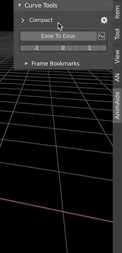
>- Reference Frames can now also be modified by moving the markers (when the "use markers" option is active).
>- You can store reference frames as bookmarks in a new panel list.\
  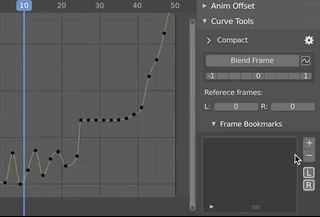
>- AnimTransform is now called **animOffset**.
>- Mask creation is now interactive.\
  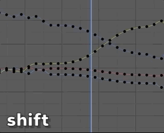
>- The mask creation tool use modifier keys to activate different options.
>- The option in the preferences to modify the interpolation of the mask soft margins (or blends) now work.
>- **animOffset** no longer deactivates **curveTools**. They can coexist now.\
  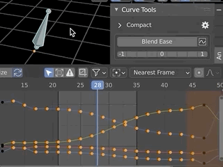
>- Added a new way of using the **curveTool**. If you don't like how the tools become active as soon as 
  you select them, there is an option in the preferences now to change that. If you unselect the option called:
  "Activate on release" the tools will become active only after you left-click and drag. Let me know if you would
  prefer it unselected by default.\
  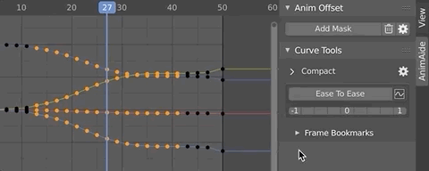

>### IMPORTANT
>If you are coming from the previous version, you might have some issues with the shortcuts. The reason is that
**AnimAide** had its oun built-in shortcuts, and they might still live in your preferences.
If that is the case you should go to "keymaps" in the preference window and there go to the "animation" sub-panel.\

In the information that follows I expand on these points.

>## Introduction: 
>
>In contrast to modeling, when animating there are not that many options to manipulate keys on an f-curve like you can 
with the vertices on a geometry. That is where **AnimAide** comes in. 
>
>There are some Blender options to manipulate keys, but **AnimAide** open the door to new possibilities. Not only has a 
wider range of tools but when working with a group of f-curves each one will have their local space.
>
>This kind of tools is standard in the game and film industry.

>## Installation
>
>First download the add-on by clicking on this link:\
><https://github.com/aresdevo/animaide/archive/master.zip>
>
>Then in Blender, go to the "Add-ons" tab in the preference window. There click on the "Install" button and navigate to the 
folder where you downloaded the addon. After you select the file and click "Install Add-on", AnimAide will be installed 
under the animation category.
>
>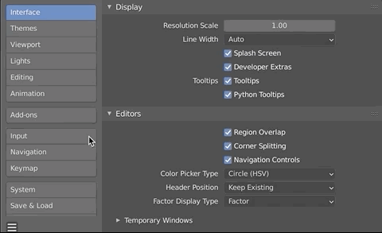
>
>Make sure the addon check-mark is active.
>
>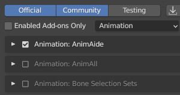

>### Where to find the tools
>
>It is available in four editors:
>
>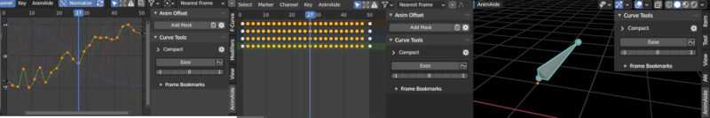
>
>You can find AnimAide the sidebar in:
>- **Graph editor**
>- **DopeSheet**
>- **Timeline editors**
>- **3D View** 
>
>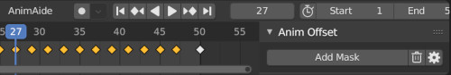
>
>You can show the sidebar by using the "n" shortcut while in one of the mentioned editors or go to the "View" menu 
on those areas and open it there.
>
>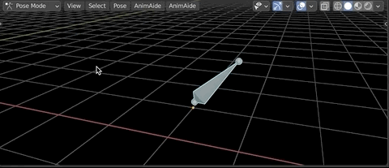

>#### Menu:
>
>All the tools are also available in a new **Animaide** menu under the Graph, DopeSheet, Timeline and 3D View editors.
>
>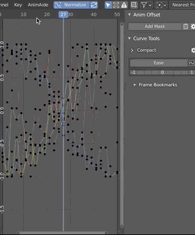
>
>#### You can add your own shortcuts:
>To do so find the tools on the "AnimAide" menu and right-click on one of them. You will then get an option to 
>add a shortcut to it.
>
>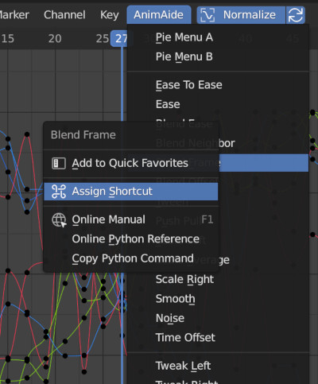

>At the moment, Animaide has two main panels:  **curveTools** and **animOffset**.
>
>Each panel has a preference menu (cog icon) that provides global settings for the tools in that panel.
>
>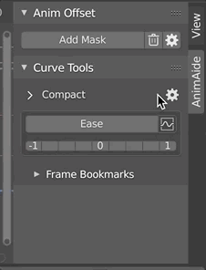

>### Tool names have changed:
>
>**Sliders is now called curveTools:**
Blender has a modal approach to things, so the way I implemented sliders to mimic similar tools in the industry didn't work as expected,
so now I'm using buttons instead.\
**AnimTransform is now called animOffset:**
Just to make it a bit clearer what it does.

>### The tools can coexist now
>Different from before you can work with both of them at the same time.
>
>

>## animOffset
>
> With this tool you can modify any animated object, and the change will propagate to the animation range. It can be
> filter by a mask. You can find the panel in all the animation editors we support but not on the 3D View.
> 
> 
>
>> ####Update:
>> A new button was added to be able to use animOffset without a mask
>The tool becomes active as soon as you create the mask
>
>The mask has the option of adding a blending border that fades the effect of the tool. The interpolation can be adjusted
in the preferences with the interpolation options.

>### The Mask creation process is interactive
>
>
>
>While creating or modifying the mask you can use modifier
keys to activate different options:
>
>>- **Without modifier:**
Creates the mask range, or moves the margins if the mask is already created.\
>>- **Shift:**
Keeps the masking mode alive. you can use it in combination with **"ctrl"** and **"alt"**.\
>>- **Ctrl:**
Soften the margins by adding blend transition to each margin. By holding it down keeps the blend manipulation alive.\
>>- **Alt:**
Let you move the entire range at once. By holding it down keeps the range manipulation alive.
>
>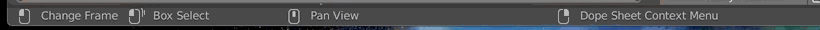
>
>Now it shows important information on the status bar, including what the modifier keys do.

>This tool only works if the current frame is inside
the margins. For this reason, when the mask is created or
modified, the cursor will be position in the middle of the mask. There is an option
in the preferences called "autokey outside margins", if selected , any time
the cursor is outside the margins while manipulating the object it will create a key.
>
>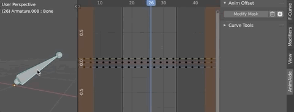

>Selecting "Fast offset calculation" option in the preferences updates the f-curves only after the transformation is over.
>
>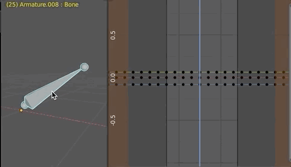

>The option in the preferences to modify the interpolation of the mask soft margins (or blends) now works:
>
>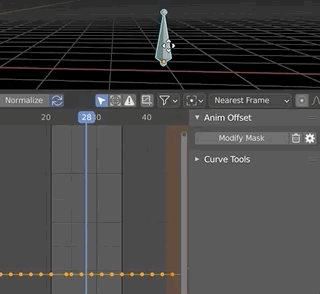

>## curveTools
>
>These panel gives you helpful tools to simultaneously manipulate keys across
multiple f-curves from either animated objects or animated bones in an armature.
>
>In most cases these tools affect the selected keys using the neighboring
unselected keys as reference. When activated from the 3D View it will act on all the f-curves in the selected object or
bone, but when is activated in one of the 3 animation editors we support it will only act on the selected channels.

>### How the interface works:
>
>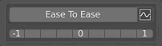
>
>**CurveTools** are now shown as buttons in the interface. After selecting some keys on one or more f-curves,
activate a tool by clicking the main big button with its name on it. The main button affects the
keys in and interactive manner.
>
>As you apply the tool information will also show in the status bar:
>
>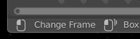

>To select other tools as the active one, there is a pop-up menu next to the main button.
>
>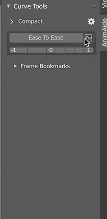
>
>Bellow there is an array of small buttons that allows you to apply the tool in increments of 25%.
I will use the last selected or activated.

>### It has two modes:
>
>
>
>>- **-Compact:**
Very similar as it used to be. You will only see one tool at a time. To select additional
ones sue the pop-up menu next to it.
>>
>>- **-Expanded:**
Expand the tools view by clicking the arrow next to the
"Compact" title. You then are able to work with all the tools
at once. The pop-up menu moves to the bottom.
>
>The Expanded mode substitute the option of adding additional sliders in the
previous version

>### Curve Tools Settings:
>
>
>
>- **Activate on release:** When this option is selected tools will behave similar to previous version
  in the sense that they will become active as soon as you select them. If you unselect it  tools will become 
  active only after you left-click and drag.\
  
>
>- **Overshoot:** allows a bigger range of change.\
  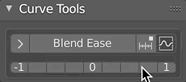
>
>- **Only keys under cursor:** Ignore selected keys and only influence the keys under the cursor of the selected channels.
>
>> - **Ease Slope:** Has been removed

>#### TIP:
> 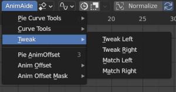
>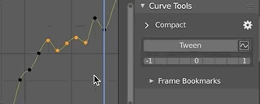
>
>To use the workflow where you jump from key to key adjusting the pose
in each frame, you would want to activate "Only keys under cursor"
> 
>in the preferences, and use the tools with shortcuts (the "Tweak" ones are particularly useful for
this).

At the moment there are 14 different tools:

>### Ease To Ease
>
>This f-curve manipulator tool transition smoothly from one end to the next with ease-in and ease-out. 
It does not remember how the curve was before activating the tool.
>
>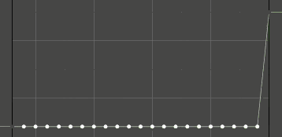
>
>### Ease
>
>With this one, you just have either an ease-in or an ease-out, but sometimes that is just what you want. It does not 
remember how the curve was before activating the tool
>
>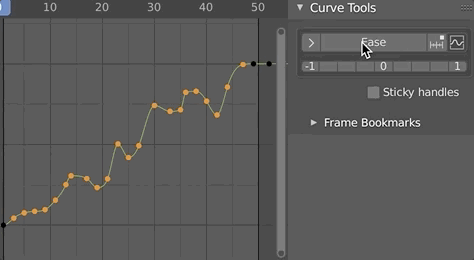

>### Blend Ease
>
>This is similar to "Ease", but it remembers how the curve was before engaging the tool.
>
>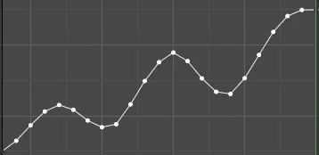

>### Blend Neighbor
>
>Progressively makes the values of the selected keys match either of the neighboring keys. it remembers how the curve was 
before engaging the tool.
>
>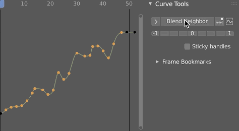

>### Blend Frame
>
>Allows you to use specific frames in the animation as reference to match values on the selected keys.
There are two buttons (Left and Right) that store the corresponding left and right reference frames. You can set
reference frames by clicking those buttons.
>
>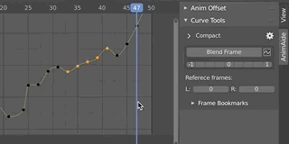
>
>By default, the option "Use markers" is active. With it, markers are position where the reference frames are.
The markers are linked to the reference frames, so if you move the markers you also modify the reference frames. 
>
>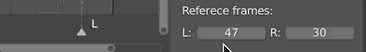
>
>it remembers how the curve was before engaging the tool.
>
>
>
>You can save additional frames as bookmark for latter use. You can find that option on a sub-panel called:
**Frame Bookmarks**
>
>

>### Blend Offset
>
>Move the selected keys as a block until it reaches either neighboring key
>
>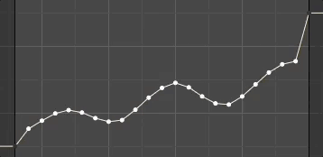

>### Push-Pull
>
>Exaggerates the values (push) or decreases the intensity of the animation (pull)
>
>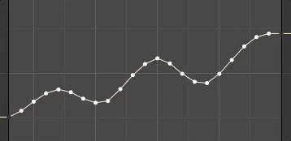

>### Scale Average
>
>Scale the values of the selected keys using the average of all the values as the anchor. 
>
>

>### Scale Left
>
>Scale the values of the selected keys using the left neighboring key as the anchor. 
>
>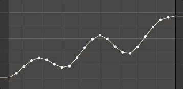

>### Scale Right
>
>Scale the values of the selected keys using the right neighboring key as the anchor. 
>
>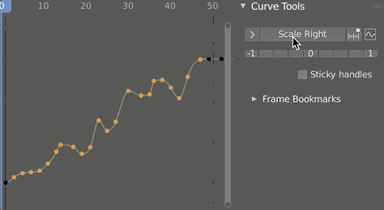

>### Smooth
>
>It will try to average the values of the keys to smooth out the f-curve. You might have to run the slider more than once to get a smoother result.
>
>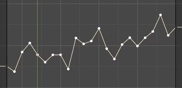

>### Noise
>
>It adds random values to the selected keys. The more you move the slider to the right de more the intensity grows.
>
>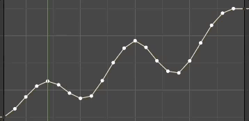

>### Time Offset
>
>The effect is similar to sliding the keys in time, but with this option, the keys stay in the same frame. It works better when there are a lot of keys.
>
>

>### Tween
>
>A simple linear transition between the neighboring keys
>
>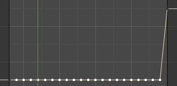

>There are two pie menus with all the tools in them. You can find them in the Animaide menu. 
Assigning a shortcut to the pie menu would be advised.
>
>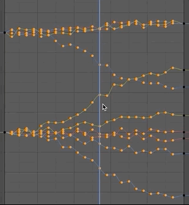

>## In Closing
>
>Thanks for the inspiration to all the people that have created similar tools for others software. I wanted to bring the 
fun to Blender and share it with the community. I hope you find these tools useful.